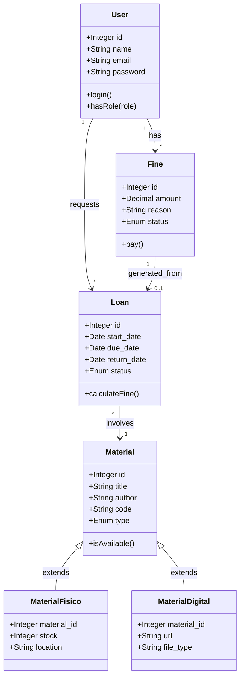
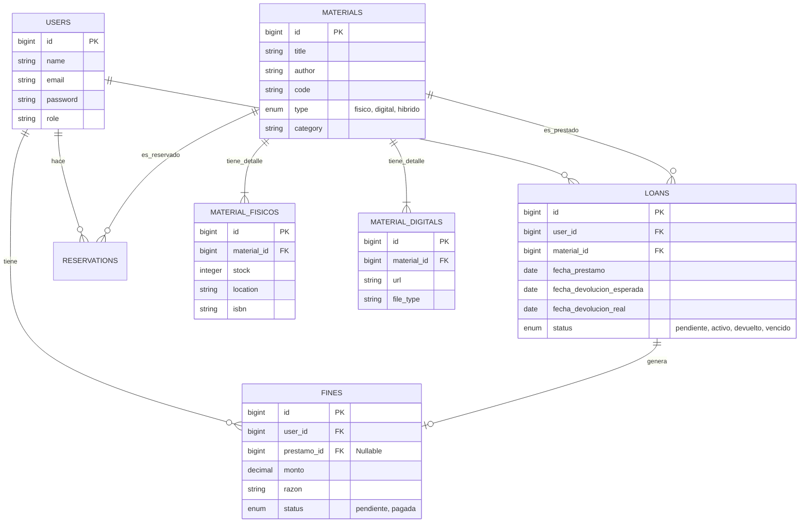

# Documentación Técnica del Sistema de Biblioteca "Pedro P. Díaz"

## 1. Requerimientos del Sistema

### 1.1. Requerimientos Funcionales (RF)

Los requerimientos funcionales definen las acciones específicas que el sistema debe ser capaz de realizar.

**Módulo de Autenticación y Usuarios:**
*   **RF-01:** El sistema debe permitir el inicio de sesión mediante correo institucional y contraseña.
*   **RF-02:** El sistema debe gestionar diferentes roles de usuario: Administrador, Trabajador, Jefe de Área y Estudiante.
*   **RF-03:** El sistema debe permitir al administrador crear, editar y deshabilitar usuarios.

**Módulo de Gestión de Materiales:**
*   **RF-04:** El sistema debe permitir registrar materiales bibliográficos de tres tipos: Físico, Digital e Híbrido.
*   **RF-05:** Para materiales físicos, se debe controlar el stock, ubicación y código ISBN.
*   **RF-06:** Para materiales digitales, se debe almacenar la URL del recurso y permitir su visualización en línea.
*   **RF-07:** El sistema debe permitir la búsqueda de materiales por título, autor o código.

**Módulo de Préstamos y Reservas:**
*   **RF-08:** Los estudiantes deben poder solicitar préstamos de libros físicos a través del sistema.
*   **RF-09:** Los administradores/trabajadores deben poder aprobar o rechazar solicitudes de préstamo.
*   **RF-10:** El sistema debe registrar la fecha de préstamo y calcular la fecha de devolución esperada.
*   **RF-11:** El sistema debe permitir registrar la devolución de un material, liberando el stock.
*   **RF-12:** El sistema debe permitir a los estudiantes reservar libros si no hay stock disponible (Cola de espera).

**Módulo de Sanciones (Multas):**
*   **RF-13:** El sistema debe calcular automáticamente multas por retraso en la devolución (S/. 1.50 por día).
*   **RF-14:** El administrador debe poder registrar multas manuales por otros incidentes (daño, pérdida).
*   **RF-15:** El sistema debe impedir nuevos préstamos a estudiantes con multas pendientes ("deudores").

**Módulo de Reportes:**
*   **RF-16:** El sistema debe permitir exportar la lista de materiales y el historial de préstamos a formato Excel/CSV.
*   **RF-17:** El sistema debe mostrar un dashboard con indicadores clave (KPIs) como libros más prestados y total de usuarios.

### 1.2. Requerimientos No Funcionales (RNF)

Los requerimientos no funcionales definen atributos de calidad, rendimiento y seguridad.

*   **RNF-01 (Usabilidad):** La interfaz debe ser intuitiva, responsiva (adaptable a móviles y tablets) y seguir principios de diseño moderno (UI/UX).
*   **RNF-02 (Seguridad):** Las contraseñas de los usuarios deben almacenarse encriptadas (Bcrypt).
*   **RNF-03 (Seguridad):** El sistema debe validar los roles para restringir el acceso a funciones administrativas.
*   **RNF-04 (Rendimiento):** El tiempo de carga de las páginas principales no debe exceder los 2 segundos en condiciones normales.
*   **RNF-05 (Disponibilidad):** El sistema debe estar disponible 24/7 para consultas de catálogo y lectura de material digital.
*   **RNF-06 (Compatibilidad):** El sistema debe ser compatible con los navegadores modernos (Chrome, Firefox, Edge, Safari).

---

## 2. Diagramas del Sistema

### 2.1. Diagrama de Clases (Simplificado)

### 2.2. Diagrama de Base de Datos (Modelo Lógico/Físico)

El sistema utiliza una base de datos relacional (MySQL/MariaDB).

---

## 3. Diccionario de Datos

A continuación se describen las tablas principales de la base de datos.

### Tabla: `users`
Almacena la información de todos los usuarios del sistema.

| Campo | Tipo de Dato | Restricciones | Descripción |
| :--- | :--- | :--- | :--- |
| `id` | BIGINT | PK, AI | Identificador único del usuario. |
| `name` | VARCHAR(255) | NOT NULL | Nombre completo del usuario. |
| `email` | VARCHAR(255) | UNIQUE, NOT NULL | Correo electrónico institucional (login). |
| `password` | VARCHAR(255) | NOT NULL | Contraseña encriptada (Hash). |
| `created_at` | TIMESTAMP | NULL | Fecha de registro. |

### Tabla: `materials`
Tabla maestra que contiene la información común de todos los libros y recursos.

| Campo | Tipo de Dato | Restricciones | Descripción |
| :--- | :--- | :--- | :--- |
| `id` | BIGINT | PK, AI | Identificador único del material. |
| `code` | VARCHAR(50) | UNIQUE | Código interno de biblioteca (ej. LIB-001). |
| `title` | VARCHAR(255) | NOT NULL | Título del libro o recurso. |
| `author` | VARCHAR(255) | NOT NULL | Autor(es) del recurso. |
| `type` | ENUM | 'fisico', 'digital', 'hibrido' | Tipo de material. |
| `description` | TEXT | NULL | Sinopsis o descripción breve. |

### Tabla: `material_fisicos`
Extensión de la tabla materials para atributos exclusivos de libros físicos.

| Campo | Tipo de Dato | Restricciones | Descripción |
| :--- | :--- | :--- | :--- |
| `id` | BIGINT | PK, AI | Identificador único. |
| `material_id` | BIGINT | FK -> materials.id | Relación con el material padre. |
| `stock` | INTEGER | DEFAULT 0 | Cantidad total de ejemplares. |
| `available` | INTEGER | DEFAULT 0 | Cantidad disponible para préstamo. |
| `location` | VARCHAR(100)| NULL | Ubicación física (Estante, Pasillo). |

### Tabla: `material_digitals`
Extensión de la tabla materials para atributos exclusivos de recursos digitales.

| Campo | Tipo de Dato | Restricciones | Descripción |
| :--- | :--- | :--- | :--- |
| `id` | BIGINT | PK, AI | Identificador único. |
| `material_id` | BIGINT | FK -> materials.id | Relación con el material padre. |
| `url` | VARCHAR(255) | NOT NULL | Enlace al recurso (PDF, Video). |
| `file_type` | VARCHAR(10) | NULL | Tipo de archivo (pdf, epub, mp4). |

### Tabla: `loans` (Préstamos)
Registra las transacciones de préstamo de materiales físicos.

| Campo | Tipo de Dato | Restricciones | Descripción |
| :--- | :--- | :--- | :--- |
| `id` | BIGINT | PK, AI | Identificador del préstamo. |
| `user_id` | BIGINT | FK -> users.id | Usuario que solicita el préstamo. |
| `material_id` | BIGINT | FK -> materials.id | Material prestado. |
| `fecha_prestamo` | DATE | NOT NULL | Fecha de inicio del préstamo. |
| `fecha_devolucion_esperada`| DATE | NOT NULL | Fecha límite para devolver. |
| `status` | ENUM | 'pendiente', 'activo', 'devuelto' | Estado actual del préstamo. |

### Tabla: `fines` (Multas)
Registra las sanciones monetarias aplicadas a los usuarios.

| Campo | Tipo de Dato | Restricciones | Descripción |
| :--- | :--- | :--- | :--- |
| `id` | BIGINT | PK, AI | Identificador de la multa. |
| `user_id` | BIGINT | FK -> users.id | Usuario sancionado. |
| `monto` | DECIMAL(8,2)| NOT NULL | Monto a pagar (S/.). |
| `razon` | VARCHAR(255)| NOT NULL | Motivo (Retraso, Daño, Pérdida). |
| `status` | ENUM | 'pendiente', 'pagada' | Estado del pago de la multa. |
